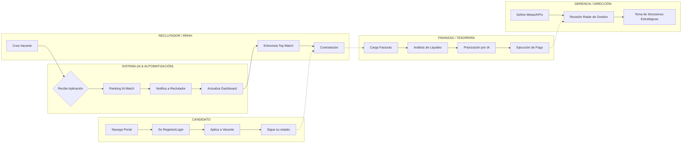

# ⚙️ Diagrama de Procesos Detallado: GH-SCORE PRO

Este documento detalla la interacción entre los diferentes actores de la organización y los módulos del sistema, asegurando que cada etapa del proceso sea trazable y eficiente.

---

## 🏎️ Procesos Operativos por Actor (Swimlanes)

Este diagrama muestra quién hace qué y cómo el sistema automatiza las tareas intermedias.

```mermaid
graph LR
    subgraph "CANDIDATO"
        C1[Navega Portal] --> C2[Se Registra/Login]
        C2 --> C3[Aplica a Vacante]
        C3 --> C4[Sigue su estado]
    end

    subgraph "SISTEMA (IA & AUTOMATIZACIÓN)"
        S1{Recibe Aplicación} --> S2[Ranking IA Match]
        S2 --> S3[Notifica a Reclutador]
        S3 --> S4[Actualiza Dashboard]
    end

    subgraph "RECLUTADOR / RRHH"
        R1[Crea Vacante] --> S1
        S4 --> R2[Entrevista Top Match]
        R2 --> R3[Contratación]
    end

    subgraph "FINANZAS / TESORERÍA"
        F1[Carga Facturas] --> F2[Análisis de Liquidez]
        F2 --> F3[Priorización por IA]
        F3 --> F4[Ejecución de Pago]
    end

    subgraph "GERENCIA / DIRECCIÓN"
        G1[Define Metas/KPIs] --> G2[Revisión Radar de Gestión]
        G2 --> G3[Toma de Decisiones Estratégicas]
    end

    %% Conexiones entre departamentos
    R3 -.-> F1
    F4 -.-> G2
    C4 -.-> R3
```

---

## 🔄 El Ciclo de Vida del Dato (Proceso Paso a Paso)

### **Fase 1: Atracción de Talento (Proceso de Sourcing)**
1.  **HR** define los requisitos en el módulo de vacantes.
2.  **Sistema** publica automáticamente en el portal público.
3.  **IA** escanea la red en busca de perfiles similares (Sourcing Activo).

### **Fase 2: Evaluación Inteligente (Proceso de Selección)**
1.  Cada hoja de vida recibida es procesada por el **Natural Language Processing (NLP)**.
2.  Se asigna un **Match Score (0-100%)** basado en experiencia, habilidades y educación.
3.  El sistema genera un "Shortlist" automático con los 5 mejores candidatos, ahorrando al reclutador la revisión manual de cientos de CVs.

### **Fase 3: Gestión de Flujo Financiero (Proceso de Pagos)**
1.  Las cuentas por pagar se integran al sistema.
2.  El motor financiero identifica facturas con **intereses de mora potenciales**.
3.  Se genera una sugerencia de pago optimizada para maximizar el descuento por **pronto pago**, protegiendo la caja de la empresa.

### **Fase 4: Análisis Directivo (Proceso de Inteligencia de Negocios)**
1.  Todos los eventos anteriores alimentan el **Data Lake**.
2.  Los tableros de control se actualizan cada 15 minutos (o tiempo real).
3.  La Gerencia recibe alertas sobre desviaciones en KPIs (ej. Vacantes vencidas o efectividad de recaudo baja).

---

## 🛠️ Reglas de Negocio Implementadas

*   **Regla de Seguridad:** Ningún usuario puede ver datos financieros sin el rol de "Director Financiero" o "Gerente".
*   **Regla de IA:** Solo candidatos con un score superior al 70% son marcados como "Recomendados" automáticamente.
*   **Regla de Pagos:** El sistema bloquea duplicidad de facturas mediante la validación del número de radicado y NIT del proveedor.

---

**Este diagrama asegura que GH-SCORE PRO no sea solo un software, sino el corazón operativo de la compañía.** 🚀💼
