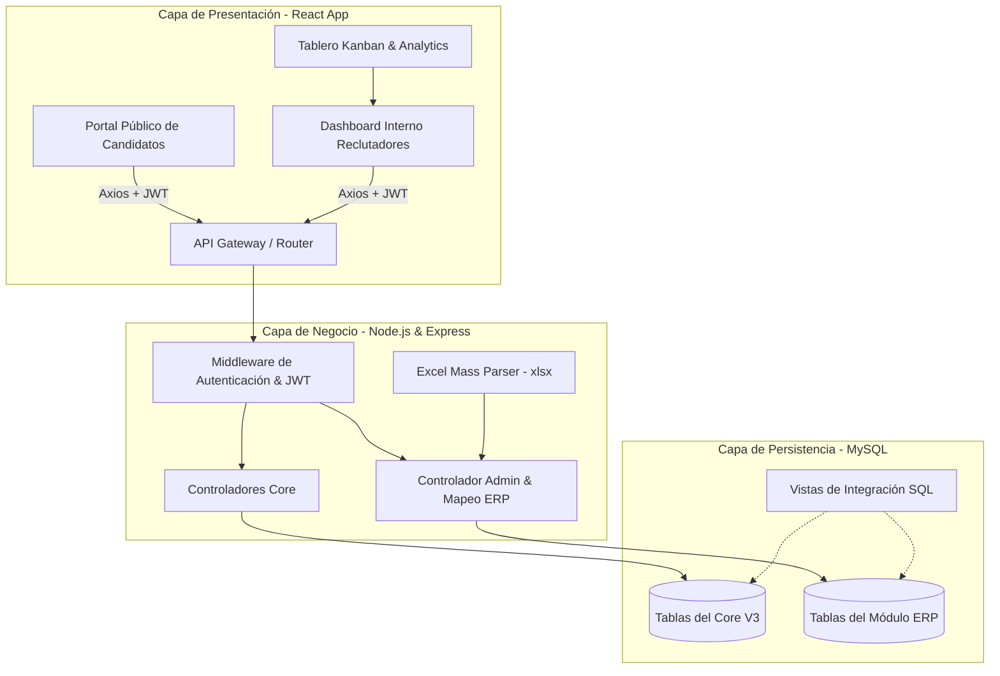
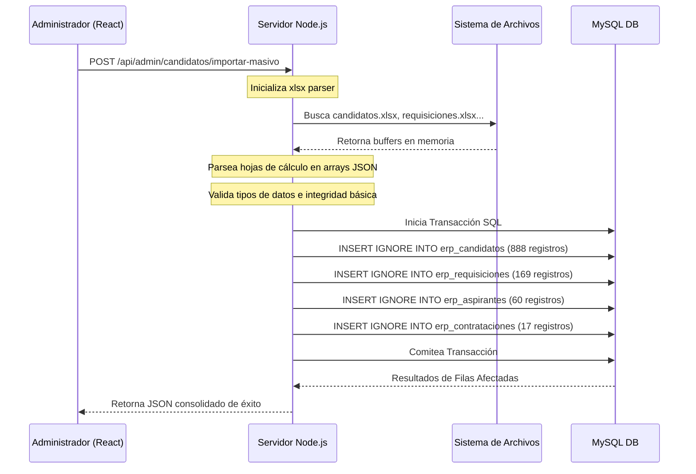

# 🦅 GH-SCORE 360 - Documentación Técnica de Arquitectura e Integración

## 📌 1. Introducción y Arquitectura de Software

El sistema **GH-SCORE 360** es una plataforma corporativa desarrollada a la medida para **DISCOL S.A.S.** con el objetivo de centralizar, automatizar y optimizar la gestión del ciclo de talento, integrando la operación nativa de Recursos Humanos con datos provenientes del software ERP de la compañía.

### 🏗️ Arquitectura de Referencia
El sistema adopta un modelo cliente-servidor desacoplado (Decoupled Single-Page Application) estructurado de la siguiente forma:



### 🛠️ Stack Tecnológico
*   **Frontend**: React (construido sobre Vite) con TypeScript, estilizado bajo una directriz "Premium Dark" mediante Tailwind CSS, utilizando Framer Motion para micro-animaciones interactivas y Chart.js para el renderizado de métricas en tiempo real.
*   **Backend**: Node.js v18+ estructurado en Express, operando mediante controladores modulares y servicios dedicados.
*   **Base de Datos**: MySQL 8.0+ optimizado con llaves foráneas, índices de alta velocidad y vistas precalculadas para mitigar la sobrecarga de consultas en procesos masivos.
*   **Librerías Críticas del Servidor**:
    *   `xlsx` para procesamiento en memoria de plantillas Excel.
    *   `bcryptjs` para encriptado asimétrico de credenciales en el portal (10 rondas de salt).
    *   `jsonwebtoken` para autenticación sin estado de candidatos y personal administrativo.

---

## 🗄️ 2. Modelo de Datos y Esquemas de Base de Datos

La base de datos de producción `sistema_gestion_talento` está dividida lógicamente en tres subsistemas altamente acoplados: **Esquema Core/SaaS**, **Portal de Candidatos & Sourcing AI**, y **Módulo de Mapeo ERP**.

---

### 2.1 Esquema Core & SaaS (Multitenancy)

Permite operar la plataforma bajo una lógica multiempresa o multisede garantizando la seguridad en el aislamiento de los datos.

```mermaid
erDiagram
    TENANTS ||--o{ ROLES : "posee"
    TENANTS ||--o{ USERS : "alberga"
    ROLES ||--o{ ROLE_PERMISSIONS : "asigna"
    PERMISSIONS ||--o{ ROLE_PERMISSIONS : "contiene"
    USERS }|--|| ROLES : "ejerce"
    VACANTES }|--|| PROCESSES : "pertenece"
    VACANTES }|--|| SEDES : "radica"

    TENANTS {
        char-36 id PK
        varchar-255 name
        varchar-50 subdomain UNIQUE
        varchar-50 tax_id
        enum status "active, suspended, archived"
        json config_json
        datetime created_at
    }
    USERS {
        int id PK
        char-36 tenant_id FK
        varchar-255 email UNIQUE
        varchar-255 password_hash
        varchar-255 full_name
        int role_id FK
        varchar-500 avatar_url
        enum status "active, inactive"
        datetime last_login
    }
    ROLES {
        int id PK
        char-36 tenant_id FK
        varchar-50 name
        varchar-255 description
        boolean is_system_role
    }
    VACANTES {
        int id PK
        varchar-50 codigo_requisicion UNIQUE
        varchar-150 puesto_nombre
        int proceso_id FK
        int sede_id FK
        date fecha_apertura
        date fecha_cierre_estimada
        enum estado "Abierta, En Proceso, Cubierta, Cancelada, Suspendida"
        enum prioridad "Baja, Media, Alta, Crítica"
        decimal presupuesto_aprobado
        decimal salario_base_ofrecido
        decimal costo_vacante
        int dias_sla_meta
    }
```

#### Tabla: `tenants`
Almacena las empresas o filiales que operan sobre la misma base de datos.
*   `id` (CHAR(36), PK): Identificador único global (UUID).
*   `subdomain` (VARCHAR(50), UNIQUE): Subdominio para ruteo dinámico de marca en frontend.
*   `status` (ENUM('active','suspended','archived')): Control del estado operativo del cliente.

#### Tabla: `users`
Personal administrativo o reclutadores asignados a un tenant específico.
*   `role_id` (INT, FK): Relación directa con los privilegios asignados.
*   `password_hash` (VARCHAR(255)): Hash seguro.

---

### 2.2 Portal de Candidatos, Sourcing AI & Postulaciones

Administra la interacción directa del postulante con el sistema y los motores de IA que miden la compatibilidad y captación.

#### Tabla: `candidatos`
Perfil maestro de postulantes que acceden al portal self-service.
*   `id` (INT, AUTO_INCREMENT, PK): Identificador secuencial.
*   `email` (VARCHAR(255), UNIQUE, INDEX): Correo corporativo o personal del candidato.
*   `experiencia_anos` (INT, DEFAULT 0): Años agregados de experiencia laboral.
*   `cv_url` (VARCHAR(500)): Ruta al repositorio cloud de la hoja de vida (Drive/Dropbox/S3).

#### Tabla: `postulaciones_agiles`
Relación N:M que conecta una `vacante` activa con un `candidato` registrado.
*   `estado` (ENUM('Nueva', 'En Revisión', 'Preseleccionado', 'Entrevista', 'Oferta', 'Contratado', 'Rechazado', 'En Reserva')): Control de etapas del embudo.
*   `auto_match_score` (INT, DEFAULT 0, INDEX): Puntuación automatizada de compatibilidad (0% - 100%) calculada al evaluar palabras clave de la vacante versus el perfil del candidato.
*   `fuente_reclutamiento` (VARCHAR(100)): Canal origen de la postulación (Computrabajo, LinkedIn, etc.).

#### Tabla: `sourcing_campaigns` & `sourced_candidates`
Motor de Inteligencia Artificial para buscar perfiles de manera proactiva en portales de empleo de terceros.
*   `filtros` (JSON): Criterios de búsqueda (habilidades, ubicación, salario).
*   `ai_match_score` (DECIMAL(5,2)): Porcentaje de compatibilidad calculado por el motor de IA.
*   `ai_analysis` (JSON): Desglose del análisis de fortalezas y debilidades del candidato.

---

### 2.3 Módulo de Integración ERP (Tablas Nuevas)

Estas tablas actúan como una capa de réplica segura (staging area) que recibe datos maestros de candidatos, requisiciones e historial de contratación desde el software ERP principal, sin modificar la lógica tradicional de `postulaciones_agiles`.

```mermaid
erDiagram
    erp_candidatos ||--o{ erp_aspirantes : "aplica"
    erp_requisiciones ||--o{ erp_aspirantes : "demanda"
    erp_aspirantes ||--o| erp_contrataciones : "deriva"
    erp_candidatos ||--o| erp_vinculaciones : "enlaza"
    candidate_accounts ||--o| erp_vinculaciones : "asocia"

    erp_candidatos {
        int id PK
        varchar-50 identificacion UNIQUE
        varchar-100 primer_nombre
        varchar-100 primer_apellido
        varchar-255 email
        varchar-20 telefono
        varchar-100 nivel_academico
        datetime fecha_registro
    }
    erp_requisiciones {
        int id PK
        varchar-20 idu_requisicion UNIQUE
        varchar-200 nombre_solicitante
        varchar-150 puesto_solicitado
        int numero_vacantes
        decimal salario_ofrecido
        enum estatus_aprobacion
        date fecha_requisicion
    }
    erp_aspirantes {
        int id PK
        varchar-20 idu_aspirante UNIQUE
        varchar-20 idu_requisicion FK
        varchar-50 numero_cedula FK
        int resultado_evaluacion
        enum decision_seleccion
        int candidato_erp_id FK
        int requisicion_erp_id FK
    }
    erp_contrataciones {
        int id PK
        varchar-20 idu_contrato UNIQUE
        varchar-20 idu_aspirante FK
        varchar-50 numero_cedula
        varchar-150 cargo
        enum estado_vinculacion
        int aspirante_erp_id FK
    }
    erp_vinculaciones {
        int id PK
        int candidate_account_id FK
        int candidato_erp_id FK
        enum vinculacion_type
        boolean activa
    }
```

#### Tabla: `erp_candidatos`
Refleja el maestro de hojas de vida del ERP.
*   `identificacion` (VARCHAR(50), UNIQUE): Cédula o número identificador del candidato en el ERP.
*   `nivel_academico` (VARCHAR(100)): Nivel de escolaridad del aspirante.

#### Tabla: `erp_requisiciones`
Requisiciones internas solicitadas por líderes de área.
*   `idu_requisicion` (VARCHAR(20), UNIQUE): Código único generado por el ERP (ej. `RP0014`).
*   `estatus_aprobacion` (ENUM('Rechazado', 'Aprobado', 'No Aprobado', 'Pendiente')): Estado de aprobación por gerencia.

#### Tabla: `erp_aspirantes`
Registros históricos de aspiraciones en el ERP.
*   `resultado_evaluacion` (INT): Puntuación consolidada del candidato basada en variables del perfil y pruebas.
*   `decision_seleccion` (ENUM('Seleccionado', 'En proceso', 'No apto', 'Pendiente')): Decisión del comité de contratación.

#### Tabla: `erp_contrataciones`
Controla el flujo de formalización contractual y recepción de documentos críticos.
*   `estado_vinculacion` (ENUM('Regular', 'Contractual', 'Suspendido', 'Finalizado', 'En proceso')): Estado legal del colaborador en nómina.
*   `examenes_medicos_estado` (ENUM('Pendiente', 'Completo', 'Rechazado')): Estado de exámenes ocupacionales obligatorios.

---

### 2.4 Vistas de Consulta Integrada

#### 1. `vw_candidatos_historial_completo`
Consolida la información de hojas de vida del ERP agregando sus números totales de procesos activos e históricos:
```sql
CREATE VIEW vw_candidatos_historial_completo AS
SELECT 
    c.identificacion,
    c.primer_nombre,
    c.primer_apellido,
    c.email,
    c.telefono,
    COUNT(DISTINCT a.id) as total_aspiraciones,
    COUNT(DISTINCT cont.id) as total_contrataciones,
    MAX(a.fecha_solicitud) as ultima_aspiracion,
    MAX(cont.fecha_creacion) as ultima_contratacion
FROM erp_candidatos c
LEFT JOIN erp_aspirantes a ON c.id = a.candidato_erp_id
LEFT JOIN erp_contrataciones cont ON a.id = cont.aspirante_erp_id
GROUP BY c.id;
```

#### 2. `vw_requisicion_flujo_completo`
Mapea el rendimiento y embudo de cada requisición originada en el ERP:
```sql
CREATE VIEW vw_requisicion_flujo_completo AS
SELECT 
    r.idu_requisicion,
    r.puesto_solicitado,
    r.estatus_aprobacion,
    COUNT(DISTINCT a.id) as aspirantes_totales,
    SUM(CASE WHEN a.decision_seleccion = 'Seleccionado' THEN 1 ELSE 0 END) as seleccionados,
    SUM(CASE WHEN a.decision_seleccion = 'No apto' THEN 1 ELSE 0 END) as no_aptos,
    COUNT(DISTINCT cont.id) as contratados,
    GROUP_CONCAT(DISTINCT a.idu_aspirante) as aspirantes_ids
FROM erp_requisiciones r
LEFT JOIN erp_aspirantes a ON r.idu_requisicion = a.idu_requisicion
LEFT JOIN erp_contrataciones cont ON a.id = cont.aspirante_erp_id
GROUP BY r.id;
```

#### 3. `vw_candidato_estado_proceso`
Retorna el estatus de contratación combinado en tiempo real de cada aspirante:
```sql
CREATE VIEW vw_candidato_estado_proceso AS
SELECT 
    c.identificacion,
    CONCAT(c.primer_nombre, ' ', c.primer_apellido) as nombre_completo,
    a.idu_aspirante,
    r.idu_requisicion,
    r.puesto_solicitado,
    a.decision_seleccion,
    cont.idu_contrato,
    cont.estado_vinculacion,
    a.resultado_evaluacion as evaluacion_score,
    a.fecha_solicitud as fecha_aspiracion,
    cont.fecha_creacion as fecha_contrato
FROM erp_candidatos c
LEFT JOIN erp_aspirantes a ON c.id = a.candidato_erp_id
LEFT JOIN erp_requisiciones r ON a.idu_requisicion = r.idu_requisicion
LEFT JOIN erp_contrataciones cont ON a.id = cont.aspirante_erp_id
WHERE a.id IS NOT NULL;
```

---

## 🛣️ 3. Referencia de API Endpoints

Todos los endpoints administrativos requieren una cabecera de autenticación JWT: `Authorization: Bearer <TOKEN>`.

### 👥 Capa de Administración e Integración ERP (`/api/admin`)

#### 1. Previsualizar Datos Excel (Sin Guardar)
*   **Método**: `GET`
*   **Ruta**: `/api/admin/candidatos/preview`
*   **Descripción**: Procesa los archivos `.xlsx` ubicados en el repositorio de descargas locales y devuelve un resumen detallado y estructurado de los registros listos para la importación.
*   **Respuesta de Éxito (`200 OK`)**:
    ```json
    {
      "success": true,
      "resumen": {
        "candidatos": 888,
        "requisiciones": 169,
        "aspirantes": 60,
        "contrataciones": 17,
        "total": 1154
      },
      "muestras": {
        "candidatos": [{ "identificacion": "10474534...", "primer_nombre": "Carlos", ... }]
      }
    }
    ```

#### 2. Importación Masiva y Ejecución de Datos
*   **Método**: `POST`
*   **Ruta**: `/api/admin/candidatos/importar-masivo`
*   **Descripción**: Lee físicamente los archivos Excel y los escribe directamente en las 5 tablas ERP de la base de datos MySQL aplicando políticas de control de duplicados (`INSERT IGNORE`).
*   **Respuesta de Éxito (`200 OK`)**:
    ```json
    {
      "exito": true,
      "cantidad": 1154,
      "detalles": {
        "candidatos": 888,
        "requisiciones": 169,
        "aspirantes": 60,
        "contrataciones": 17
      }
    }
    ```

#### 3. Obtener Candidatos ERP (Listado Paginado y Filtrado)
*   **Método**: `GET`
*   **Ruta**: `/api/admin/candidatos`
*   **Query Parameters**:
    *   `q` (opcional): Filtro por nombre o número de cédula.
    *   `estatus` (opcional): Filtro por estado de selección.
*   **Respuesta de Éxito (`200 OK`)**:
    ```json
    {
      "success": true,
      "count": 888,
      "data": [
        {
          "id": 1,
          "identificacion": "1047...",
          "nombre_completo": "Carlos Mendoza",
          "email": "carlos@discol.com",
          "nivel_academico": "Profesional",
          "total_aspiraciones": 2,
          "total_contrataciones": 1
        }
      ]
    }
    ```

#### 4. Obtener Detalle Individual del Candidato ERP
*   **Método**: `GET`
*   **Ruta**: `/api/admin/candidatos/:cedula`
*   **Descripción**: Obtiene la información personal del candidato recopilada del ERP, junto con todo su historial de postulaciones, evaluaciones aplicadas y estatus de contratación asociados en las vistas SQL.

#### 5. Registrar Candidato ERP Manualmente
*   **Método**: `POST`
*   **Ruta**: `/api/admin/candidatos/registrar`
*   **Body**: `{ identificacion, primer_nombre, primer_apellido, email, telefono, nivel_academico }`

---

### 👤 Capa de Portal Autogestionable para Candidatos (`/api/candidates`)

*   `POST /api/candidates/auth/register`: Registra un nuevo candidato en la plataforma interna.
*   `POST /api/candidates/auth/login`: Autentica al candidato y le otorga un JWT con una validez de 30 días.
*   `GET /api/candidates/profile`: Devuelve el perfil completo del candidato (educación, habilidades, idiomas).
*   `PUT /api/candidates/profile`: Permite la edición y actualización de la información profesional de autogestión.
*   `GET /api/candidates/applications`: Permite al candidato monitorear en tiempo real sus procesos de selección activos.

---

## ⚙️ 4. Pipeline de Importación Masiva ERP

El importador masivo utiliza un flujo de lectura y procesamiento asíncrono para leer en bloque grandes cantidades de registros desde planillas de Excel comerciales y persistirlas sin generar caídas por saturación del procesador.



### Código Clave: Parser de Excel en Servidor
El motor procesa dinámicamente las columnas de los archivos de Excel descargados mapeándolas a los tipos definidos en la base de datos (por ejemplo, en `import_candidates_preview.js`):

```javascript
const xlsx = require('xlsx');
const path = require('path');

function leerExcel(fileName, sheetName) {
    const filePath = path.join(process.env.DOWNLOADS_PATH || 'C:/Users/analistasistema/Downloads', fileName);
    const workbook = xlsx.readFile(filePath);
    const sheet = workbook.Sheets[sheetName || workbook.SheetNames[0]];
    return xlsx.utils.sheet_to_json(sheet);
}
```

Para asegurar que el backend permanezca altamente disponible ante imports de más de 1,000 registros, las inserciones se realizan utilizando **inserciones masivas con bloques parametrizados** en una sola transacción SQL, mitigando bloqueos en las tablas del negocio corporativo.

---

## 🔧 5. Despliegue, Configuración y Scripts de Administración

### 📌 5.1 Variables de Entorno (`.env`)

Tanto el cliente como el servidor requieren llaves específicas configuradas en producción para operar adecuadamente:

#### Configuración del Servidor (`/server/.env`)
```ini
PORT=5000
NODE_ENV=production

# Base de Datos MySQL
DB_HOST=127.0.0.1
DB_PORT=3306
DB_USER=root
DB_PASS=admin123_pass
DB_NAME=sistema_gestion_talento

# Seguridad
JWT_SECRET=super_secure_key_360_discol_sas_jwt_key
JWT_EXPIRES_IN=30d

# Configuración de Archivos ERP
DOWNLOADS_PATH=C:/Users/analistasistema/Downloads
```

---

### 📌 5.2 Scripts Útiles de Administración

El servidor cuenta con varios scripts para automatizar las tareas del área de desarrollo o soporte de TI:

1.  **Ejecutar Migración de Estructura Completa**:
    ```bash
    cd server
    node run_migration.js
    ```
    *(Ejecuta secuencialmente los scripts SQL de creación de tablas y vistas core).*

2.  **Instalar Esquema del Portal de Candidatos**:
    ```bash
    cd server
    node install_candidate_schema.js
    ```
    *(Verifica e instala la tabla `candidatos`, `candidate_skills`, etc., en bases de datos preexistentes).*

3.  **Probar Importación y Verificación Local**:
    ```bash
    cd server
    node import_candidates_preview.js
    ```
    *(Ejecuta una prueba del parser de hojas de cálculo de manera local, imprimiendo en la consola del desarrollador la cantidad de registros e información recuperada antes de confirmarse su escritura en el motor de base de datos).*

4.  **Verificar Triggers y Procedimientos Almacenados**:
    ```bash
    cd server
    node check_triggers.js
    ```

---

## 🛡️ 6. Políticas de Seguridad y Escalabilidad

1.  **Protección JWT Estricta**: Ningún cliente externo puede acceder al ruteo `/api/admin/*` sin adjuntar una firma digital JWT provista de manera exclusiva al personal de reclutamiento.
2.  **Transaccionalidad del Importador**: Si una sola fila del proceso de importación del Excel genera un error estructural crítico en la integridad de la base de datos, toda la transacción de importación masiva se cancela (`ROLLBACK`), asegurando consistencia de datos de un 100%.
3.  **Prevención de Inyecciones SQL**: Todas las consultas internas se procesan utilizando sentencias preparadas (Prepared Statements) parametrizadas por Sequelize u operaciones nativas de `mysql2`.
