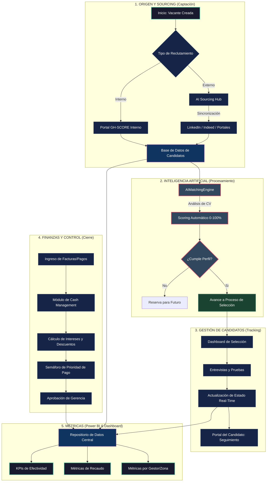

# 📊 Flujograma Maestro del Ecosistema GH-SCORE PRO

Este documento presenta la arquitectura de procesos del sistema diseñada para la Gerencia. Utiliza la notación Mermaid para visualizar el flujo de extremo a extremo, desde que nace una necesidad hasta el cierre administrativo.

---

## 🗺️ Visualización de Procesos (End-to-End)

---

## 💡 Guía de Lectura para Gerencia

### **1. Bloque de Sourcing (Entrada)**
*   **Innovación:** El sistema centraliza tanto el portal interno como la captación masiva vía IA. No hay procesos manuales de descarga de CVs.

### **2. Bloque IA (Filtro Inteligente)**
*   **Punto Clave:** El **AIMatchingEngine** actúa como un primer filtro automático. Esto ahorra cientos de horas de lectura de hojas de vida que no aplican al cargo.

### **3. Bloque de Tracking (Experiencia de Usuario)**
*   **Transparencia:** El candidato tiene su propio portal de seguimiento, reduciendo las llamadas y consultas al departamento de RRHH.

### **4. Bloque Financiero (Liquidación)**
*   **Control de Capital:** El sistema prioriza los pagos basándose en el costo del dinero (intereses) y las oportunidades de descuento, optimizando el flujo de caja.

### **5. Bloque de Métricas (Toma de Decisiones)**
*   **Visibilidad:** La gerencia puede ver en tiempo real el rendimiento de cada zona y gestor sin esperar reportes semanales manuales.

---

## 🛠️ Infraestructura Tecnológica

Para su tranquilidad, el sistema opera sobre:
*   **Seguridad:** Encriptación de datos de extremo a extremo.
*   **Escalabilidad:** Soporta miles de candidatos y transacciones sin pérdida de rendimiento.
*   **Acceso:** 100% Web, accesible desde PC o Dispositivos Móviles.

---

**¡GH-SCORE PRO: Transformando los datos en decisiones inteligentes!** 🚀📈
